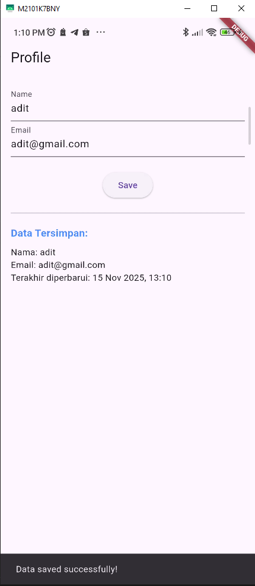
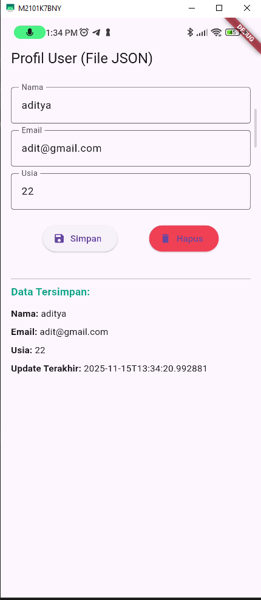
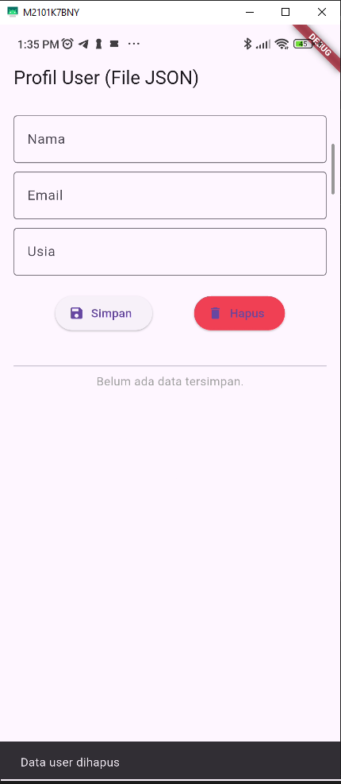

Laporan Praktikum Jobsheet Dart

## Praktikum 1 - JSON Dart Konversi Model Dart ke JSON

Hasil Screenshot dari praktikum ini

## Praktikum 2: Menangani JSON yang Tidak Kompatibel

Hasil Screenshot dari praktikum ini

## Praktikum 3: Penanganan Error di JSON

Hasil Screenshot dari praktikum ini

## Praktikum 4: Menyimpan Data JSON di SharedPreferences

Hasil Screenshot dari praktikum ini

## Praktikum 5: Menyimpan Data JSON di File

Hasil Screenshot dari praktikum ini
a. Menyimpan data JSON di file

b. Menghapus data JSON dari file

